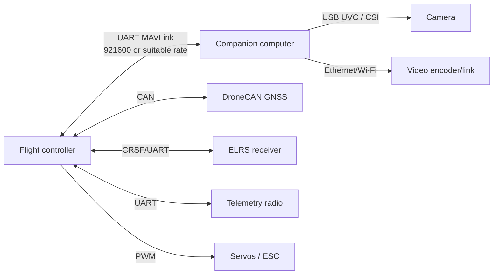

# Wiring and interfaces

Wiring starts when the project moves from software-in-the-loop (SITL) to the hardware bench core in the [Learning path](../start/learning-path.md). Every connection should preserve the same MAVLink, power, video, and manual-control boundaries tested in simulation.

## Interface map



## Recommended port plan

| Function | Preferred connection | Fallback | Notes |
|---|---|---|---|
| Companion MAVLink | UART, hardware flow control where supported | USB serial | Isolate/validate 3.3 V logic levels |
| GNSS | DroneCAN | UART + I²C compass | Avoid using I²C for long noisy runs |
| RC | CRSF UART | SBUS | Keep a dedicated manual-control port |
| Telemetry | UART | network MAVLink | Maintain a distinct route from companion if possible |
| Airspeed | CAN / I²C as board permits | UART | Reserve it even when absent initially |
| Camera | USB UVC | CSI | Use strain relief and a service loop |

## Wiring checklist

```text
[ ] TX/RX crossover validated at both ends
[ ] Shared ground present for UART link
[ ] Logic voltage validated—no 5 V signal into 3.3 V-only input
[ ] FC board target and firmware selected before calibration
[ ] Servo order confirmed without propeller fitted
[ ] ESC/motor test only after aircraft is restrained and prop safety procedure is in place
[ ] Connector labels match schematic and physical harness
[ ] Schematic committed to repository with revision number
```

## Connector policy

- Use locking connectors for any connection that can work loose during a landing.
- Keep a single connector family per voltage/current class where possible.
- Never assume wire colors are consistent across vendors; test every harness.
- Photograph the completed harness and add it to the build record.
