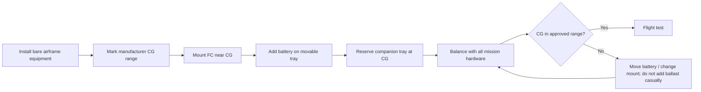

# Airframe and propulsion

## Select by integration space, not by visual style

A pusher fixed-wing aircraft is preferred for this project because its nose can carry a camera without propeller intrusion and the fuselage can hold a battery plus compute close to the center of gravity.

| Requirement | Why it matters | Acceptance test before buying |
|---|---|---|
| 1.6–2.0 m wingspan for the reference build | Payload, lower wing loading, better space for safe integration | Can carry battery, flight controller, camera and future compute without packing wires against the GNSS |
| Removable wings | Transport, maintenance, access to wiring | Disconnection is repeatable and strain-relieved |
| Pusher propeller | Clean forward/downward camera view; safer nose placement | Camera has unobstructed FOV and prop wash does not dominate the image |
| Spacious CG bay | Jetson/battery can move without a rebuild | There is a 100–150 mm zone around CG for future payload adjustment |
| Repairable structure | Crashes and hard landings are a learning cost | Foam or parts can be repaired/replaced locally |
| Landing strategy | Fixed wing needs a repeatable landing plan | Belly landing surface / skids are practical at intended field |

## Airframe classes

| Class | Typical role | Recommendation |
|---|---|---|
| **Small 1.2–1.5 m foam pusher** | Manual skills, ground-first video test | Lowest cost, but expect a rebuild for substantial onboard compute |
| **Medium 1.6–2.0 m cargo pusher** | This project’s reference platform | Best compromise between portability, repairability and future payload |
| **Large 2.0 m+ utility airframe** | Dual camera, long endurance, Orin NX, more batteries | Choose only once field handling, transport and launch/landing logistics are solved |
| **VTOL fixed wing** | Later research objective | Do not select for first autonomy work; transition and propulsion complexity multiply test cases |

## Propulsion design rules

- Select propulsion for a conservative cruise, not maximum speed.
- Use a quality ESC with adequate headroom, a serviceable propeller mount, and spare props.
- Reserve a servo output and space for an airspeed sensor even if it is not fitted initially.
- Keep high-current ESC/motor wiring physically away from compass, GNSS antenna, and video antenna.
- Build around a battery connector standard you can inspect and service. Use robust strain relief.

## Center-of-gravity workflow

!!! warning "Do not use the companion computer as random ballast"
    It should have a repeatable tray near the CG. The battery remains the primary adjustable mass.
