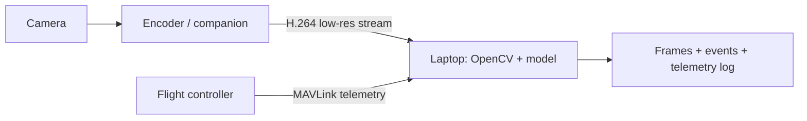

# Compute and cameras

## Decision: laptop first, companion later

The best first vision build sends a low-resolution stream to the ground laptop and runs inference there. That lets you validate the camera, target, model, telemetry association and operator workflow without turning an airborne computer into a reliability risk.

## Compute options

| Option | Use it for | Strength | Limitation | Recommendation |
|---|---|---|---|---|
| **Laptop only** | First 10–20 vision flights | Fastest debug loop; no airborne GPU | Depends on video link; no onboard decisions | Start here |
| **Raspberry Pi 5** | Recording, stream encoding, simple OpenCV, light models | Low power, low cost, broad ecosystem | Limited GPU/AI acceleration compared with Jetson | Good link/recording node |
| **Jetson Orin Nano 8 GB** | Lightweight onboard detection and TensorRT learning | Modern NVIDIA stack with meaningful edge-AI capability | Power and thermal design still matter | Preferred onboard starter |
| **Jetson Orin NX 16 GB** | Multiple cameras, heavier models, future perception | Major headroom | Cost, heat, payload and integration complexity | Buy only when workload is proven |
| **Jetson Nano** | Existing hardware / classroom experimentation | Familiar tutorials | Old platform; poor value as a new purchase | Do not buy new for this project |

NVIDIA positions current Orin Nano modules in a 7–25 W power range and the developer kit is a reference carrier intended for development. For airborne use, bench-development hardware and the eventual production carrier should be treated as separate purchases.

## Camera choice

| Interface | First choice? | Pros | Cons |
|---|---|---|---|
| **USB UVC** | Yes | Easily interchangeable between laptop, Pi and Jetson; straightforward software support | Can be physically bulkier; USB cable retention matters |
| **CSI camera** | Later | Efficient and low latency on the chosen compute platform | Carrier/cable specific; less interchangeable |
| **Network camera** | Later | Long cable options and direct streaming | Power/network complexity; not needed initially |

## Camera mounting requirements

- Put the camera on a rigid mount with a known field of view.
- Mount near the aircraft centerline; document its pitch/yaw offset from the body frame.
- Keep a removable sun hood/lens protector option.
- Create a small service loop and strain relief for USB/CSI cable.
- Record a calibration dataset after any mount angle, lens, or resolution change.

## Jetson installation rule

Mount the **module/carrier assembly** close to the aircraft CG on a restrained tray with airflow. Do not use the full developer kit as a final airborne integration unless the airframe has verified space, payload and cooling margin.
