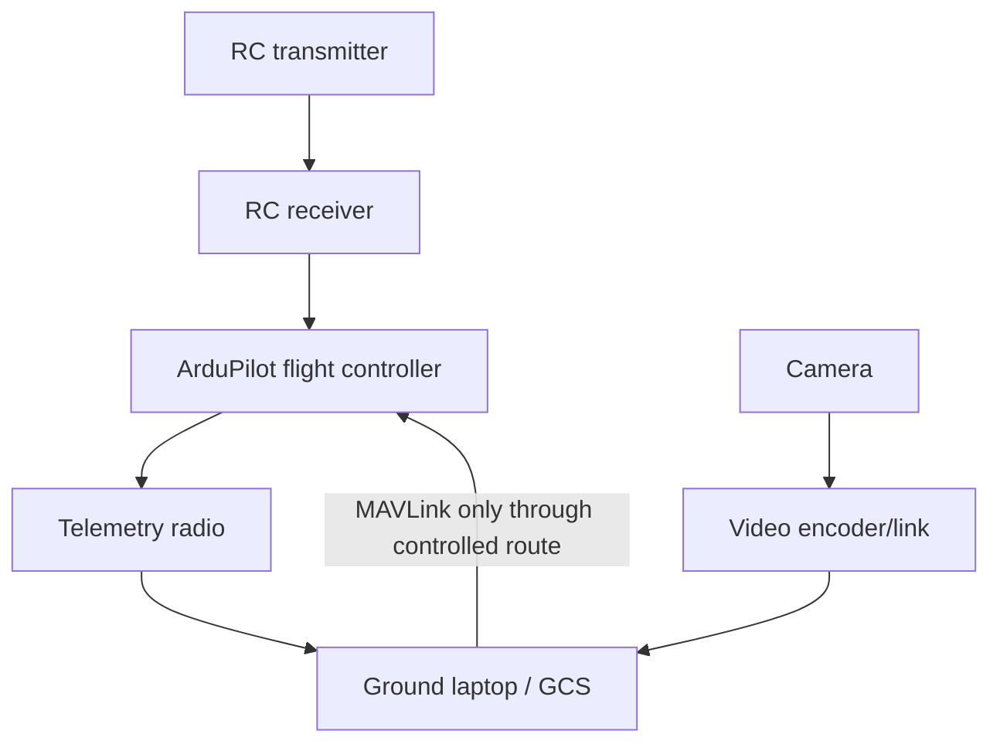

# Video, telemetry, and RC

## Keep command, telemetry and video independent



| Link | Primary purpose | Failure behavior | Recommendation |
|---|---|---|---|
| RC / manual control | Immediate pilot override | FC executes configured RC-loss action | ExpressLRS ecosystem, region-appropriate receiver/transmitter |
| Telemetry | Vehicle state, mission upload, logs | Do not rely on it for immediate manual recovery | MAVLink-capable independent link |
| Video | Situational awareness and ground inference | Detection stops; flight continues safely | Low-res H.264 preview + high-res local recording |
| Maintenance Wi-Fi/Ethernet | Bench configuration and log retrieval | Never required for flight | Separate service network |

## Video transport choices

| Path | Best use | Advantages | Caveat |
|---|---|---|---|
| **RTSP/UDP over local Wi-Fi** | Bench tests and very short-range field trial | Fast to prototype with GStreamer / FFmpeg | Link robustness and regulatory suitability must be evaluated |
| **OpenHD / WFB-ng class link** | Open-source digital video + telemetry experiments | Low-latency video architecture, flexible hardware | RF setup, antenna layout and local spectrum rules require care |
| **Commercial digital FPV** | Pilot view, mature packaged experience | Often convenient and robust | Less transparent integration; may require capture hardware for laptop inference |
| **Record-only** | Dataset collection | Simplest, highest-quality evidence | No live detection |

## Start with this data rate

```text
Preview: 640×480 or 854×480, 5–15 fps, H.264
Archive: highest practical native resolution to onboard storage
Telemetry: 5–10 Hz position/attitude for association with detections
```

!!! warning "Never make video the control link"
    A loss of video must not remove manual flight control, telemetry safety behavior, or the ability to use a transmitter mode switch.
