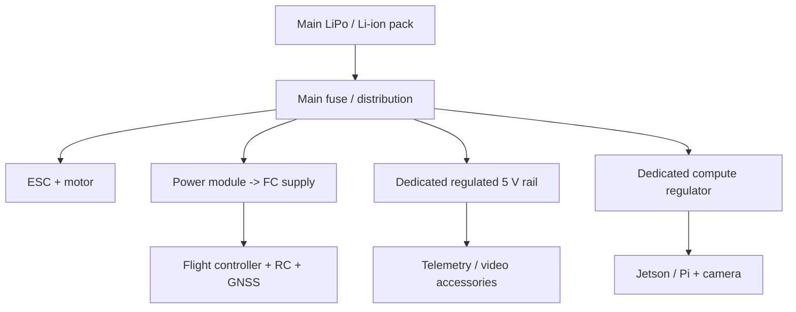

# Power and wiring

## Power architecture



## Rules that prevent expensive failures

1. **Never power an Orin-class computer from the flight controller’s 5 V rail.**
2. Use a dedicated, fused regulator sized for startup current plus margin.
3. Make the flight-controller rail independently robust—even if compute/video is unplugged or shorted.
4. Keep all ground references deliberate, short and documented; avoid long ground loops around video/ESC wiring.
5. Label every connector and make plugs mechanically unambiguous.
6. Verify voltage and current calibration before relying on battery failsafe.

## Harness strategy

| Harness | Recommended approach |
|---|---|
| Motor/ESC | Short, appropriately gauged conductors; physically separate from GNSS/compass |
| Servo | Locking/retained connectors, strain relief, clear channel labels |
| MAVLink UART | Twisted signal/ground where practical; 3.3 V logic verified; TX/RX crossed |
| Camera | Secured USB/CSI cable with service loop; no dangling cable near control linkage |
| GNSS | High and away from power/video transmitters; external compass wiring protected |
| Compute power | Dedicated fuse, connector rated for current, voltage monitor point |

## Electrical acceptance tests

```text
[ ] FC stays powered when compute branch is disconnected
[ ] FC stays powered when video branch is disconnected
[ ] Current reading matches external meter within accepted tolerance
[ ] No GNSS/compass interference with motor at partial and full throttle (restrained bench test)
[ ] Compute restarts without corrupting FC telemetry
[ ] No cable can enter propeller arc or control linkage travel
```
