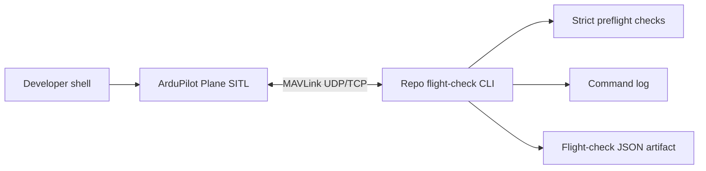

# Software-in-the-loop (SITL) flight check

This page tracks the second software-in-the-loop (SITL) implementation milestone: a command-sending fixed-wing flight check. It deliberately starts after the [SITL smoke test](sitl-smoke-test.md), because the smoke test proves that the simulator is reachable, the vehicle is fixed-wing ArduPilot, the vehicle is unarmed, and basic telemetry is present without sending commands.

The flight check is the first place where repo code may send Micro Air Vehicle Link (MAVLink) commands. Keep it separate from the smoke test so the safe observation baseline remains boring and reusable.

## Goal

Create a repeatable local workflow that proves the repo can command a virtual fixed-wing aircraft under explicit safety gates, record every command it sends, and end in a known state.



## Why this comes second

The first milestone is intentionally observation-only. This milestone is where we cross the command boundary, so it needs a different contract:

| Difference | Smoke test | Flight check |
|---|---|---|
| Default posture | Observe only | Sends commands after explicit opt-in |
| Command log | Must stay empty | Must record every command |
| Failure mode | Exit before writing a passing result | Abort safely and record the last known state |
| Use | Cheap baseline before any work | Controlled proof that command policy works in SITL |

This is still simulator-only. It does not prove real launch behavior, landing behavior, control-surface setup, power integrity, radio-frequency behavior, or legal readiness.

## Safety contract

The first command-sending tool must make unsafe use hard to do accidentally.

Required design rules:

| Rule | Why |
|---|---|
| Require an explicit opt-in flag | Prevent accidental arming from a copied command |
| Re-run strict smoke-test preflight checks first | Do not command a vehicle that fails the boring baseline |
| Record every command in `commanded_actions` | Preserve reviewable evidence of what repo code did |
| Use fixed-wing SITL by default | Keep the learning path aligned with the aircraft design |
| End with a known safe state | Later tests should not inherit a surprising simulator state |
| Keep detector/model output out of the loop | Vision decisions must not command controls in this stage |

The initial CLI should refuse to run unless a flag such as `--i-understand-this-sends-commands` is present. The exact flag name can change during implementation, but the intent should not.

## Proposed scope

Start with the smallest fixed-wing path that proves command authority without turning this into a full mission system.

Planned command sequence:

1. Connect to the same stable MAVLink endpoint used by the smoke test.
2. Run the strict baseline checks: fixed-wing ArduPilot, unarmed, position telemetry, battery telemetry.
3. Record the preflight state in the artifact.
4. Switch to Plane `TAKEOFF` mode when the mode is available.
5. Arm.
6. Send `MAV_CMD_NAV_TAKEOFF` with the first conservative target altitude.
7. Record a final observed state through the same telemetry path used for preflight.

Return-to-launch, landing, and progress assertions are still future work. The exact larger ArduPilot flow should be chosen while testing against live Plane SITL. Do not guess the final flight profile before the simulator proves it.

## Artifact skeleton

The flight-check artifact should extend the smoke-test artifact style but clearly mark that commands were sent.

```json
{
  "schema_version": 1,
  "source": "sitl-flight-check",
  "connected": true,
  "status": "ok",
  "captured_at": "2026-07-06T12:34:56Z",
  "required_checks": [
    "unarmed",
    "vehicle",
    "ardupilot",
    "position",
    "battery",
    "explicit-command-opt-in"
  ],
  "commanded_actions": [
    {
      "action": "set_mode",
      "requested": "TAKEOFF",
      "result": "accepted"
    },
    {
      "action": "arm",
      "result": "accepted"
    },
    {
      "action": "takeoff",
      "altitude_m": 30,
      "result": "sent"
    }
  ],
  "preflight": {
    "mode": "MANUAL",
    "armed": false
  },
  "final_state": {
    "mode": "TAKEOFF",
    "armed": true
  }
}
```

Keep the schema small at first. Add fields only when they are useful for debugging or later automation. When a command is rejected before the nominal final observation, the artifact uses `status: "failed"` and `final_state: null` while preserving the rejected command entry.

## Failure policy

The flight check should fail closed.

| Failure | Expected behavior |
|---|---|
| Explicit command opt-in is missing | Exit before connecting or sending commands |
| Strict preflight check fails | Exit before sending commands |
| Mode change is rejected | Stop, record the rejection, do not arm |
| Arming is rejected | Stop, record the rejection |
| Progress condition is not met before timeout | Command the safest documented end action available, then fail |
| Final state cannot be observed | Fail before reporting a passing result |

When in doubt, prefer a boring failed artifact over hiding an ambiguous state.

## Test strategy

Unit tests should cover contracts that do not require a running simulator:

| Test area | What to prove |
|---|---|
| CLI opt-in | Command-sending path refuses to run without explicit opt-in |
| Command log | Every planned command becomes an artifact entry |
| Preflight reuse | Flight check does not bypass strict smoke-test checks |
| Failure handling | Rejected commands produce failed artifacts |
| Final state | Accepted command plans serialize the post-command heartbeat summary |
| Schema | Artifact shape remains stable enough for review |

Live SITL testing should remain a documented manual step until the command sequence is stable enough for continuous integration.

## Done for milestone 2

This milestone is done when a developer can run the second-stage workflow locally and prove:

```text
start ArduPlane SITL -> run flight check with explicit command opt-in -> observe command sequence -> end safely -> review artifact
```

The artifact must show:

| Evidence | Expected result |
|---|---|
| Preflight checks | Strict baseline passed before commands |
| `commanded_actions` | Non-empty and ordered |
| Mode/arm commands | Recorded with results |
| Progress observation | Altitude, position, mode, or mission progress was checked once implemented |
| Final state | Serialized for accepted command plans, or `null` when command rejection prevents it |
| Vision/model involvement | None |

After this milestone, the next simulation work should be failure drills: reconnect behavior, low-battery action, fence action, and command rejection when preconditions are false.
