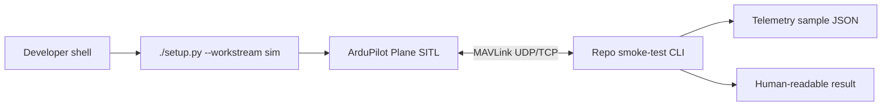

# SITL smoke test

This page is a skeleton for the first software-in-the-loop (SITL) implementation milestone. Keep it updated as the commands, files, and checks become real. See the [glossary](../appendix/glossary.md) for recurring abbreviations.

## Goal

Create a repeatable local workflow that proves the repo can connect to a virtual fixed-wing aircraft and observe it safely.



## Recommended implementation shape

Start with a small Python command because the repo already uses `uv` and the `sim` dependency group for MAVSDK-Python and pymavlink.

Expected future layout:

```text
tools/
└── sim/
    ├── README.md
    └── sitl_smoke_test.py

tests/
└── sitl/
    └── test_sitl_smoke_contract.py

artifacts/
└── sitl/
    └── .gitkeep
```

The exact paths can change when code exists, but keep the boundaries:

| Boundary | Rule |
|---|---|
| SITL | External ArduPilot checkout, not vendored into this repo |
| Repo command-line interface (CLI) | Connects to MAVLink and records observations |
| Tests | Validate parser/output contracts without requiring SITL for every unit test |
| Artifacts | Small examples may be committed; large logs stay out of Git |

## Local setup skeleton

Install the project-side simulator client tools:

```bash
./setup.py --workstream sim --no-shell
```

Install and build ArduPilot SITL separately, following the upstream ArduPilot Linux setup. Keep that checkout outside this repository.

Start a fixed-wing simulator:

```bash
sim_vehicle.py -v ArduPlane --console --map -w
```

The future repo command should look roughly like:

```bash
uv run python tools/sim/sitl_smoke_test.py --connect udp://127.0.0.1:14550 --duration 30
```

## Telemetry to capture first

Capture only enough to prove the link and support later safety checks.

| Field | Why |
|---|---|
| Timestamp | Correlates events, logs, and video later |
| System/component identifiers (IDs) | Confirms which MAVLink endpoint replied |
| Heartbeat and mode | Confirms vehicle identity and current control state |
| Armed state | Proves the smoke test did not arm the vehicle |
| Position / relative altitude | Proves basic telemetry subscriptions work |
| Battery status | Needed for later low-battery failure drills |
| Link or message timing | Shows stale-data handling can be tested |

Initial artifact shape:

```json
{
  "schema_version": 1,
  "source": "sitl-smoke-test",
  "vehicle": "ArduPlane SITL",
  "connected": true,
  "armed": false,
  "mode": "MANUAL",
  "samples": []
}
```

## Safety constraints

The first smoke test must be observation-only.

```text
[ ] no arming command
[ ] no mode change command
[ ] no mission upload
[ ] no parameter write
[ ] no actuator command
[ ] no detector/model decision in the loop
```

Later tests can add controlled commands, but only after the command policy and safety gates are documented.

## Failure cases to document

Add each case as it is observed:

| Failure | Expected behavior |
|---|---|
| SITL not running | CLI exits with a clear connection error |
| Wrong endpoint | CLI prints the attempted endpoint and times out |
| No heartbeat | CLI fails before subscribing to telemetry |
| Stale telemetry | CLI marks samples stale instead of treating them as current |
| Reconnect | CLI records reconnect events without changing vehicle state |

## Done for milestone 1

The milestone is done when the implementation proves this path:

```text
setup sim tools -> start ArduPlane SITL -> run repo smoke test -> save telemetry sample -> review result
```

Keep the result boring. The value is a dependable baseline that every later autonomy feature can run against.
