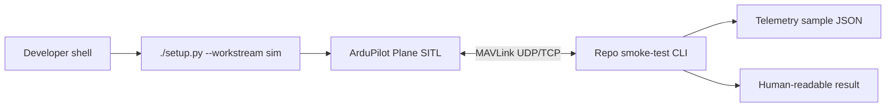

# Software-in-the-loop (SITL) smoke test

This page tracks the first software-in-the-loop (SITL) implementation milestone. The basic smoke test now exists and should stay observation-only until command policy and safety gates are documented. See the [glossary](../appendix/glossary.md) for recurring abbreviations.

## Goal

Create a repeatable local workflow that proves the repo can connect to a virtual fixed-wing aircraft and observe it safely.



## Current implementation

The first slice is intentionally small because the repo already uses `uv` and the `sim` dependency group for MAVLink client tooling.

Current layout:

```text
sitl/
├── pyproject.toml
├── README.md
├── src/
│   └── sitl/
│       ├── artifacts.py
│       ├── flight_check.py
│       ├── preflight.py
│       ├── run.py
│       ├── smoke_test.py
│       └── telemetry.py
└── tests/
    ├── test_artifacts.py
    ├── test_flight_check.py
    ├── test_preflight.py
    ├── test_run.py
    ├── test_smoke_test.py
    └── test_telemetry.py

artifacts/
└── sitl/
    └── smoke.json          # generated, not committed
```

These paths are the first slice of the canonical layout described in [Development stack](../software/development-stack.md#monorepo-layout). Keep the boundaries:

| Boundary | Rule |
|---|---|
| SITL | External ArduPilot checkout, not vendored into this repo |
| SITL package | Lives under `sitl/`, owns its Python dependencies, and exposes `sitl-run`, `sitl-smoke-test`, and `sitl-flight-check` entry points |
| Tests | Validate parser/output contracts without requiring SITL for every unit test |
| Artifacts | Generated local evidence under `artifacts/`; do not commit routine smoke-test output |

## Local setup skeleton

The detailed, working local procedure lives in `sitl/README.md`. The executive summary is:

```bash
./setup.py --workstream sim
uv run --project sitl --group sim python -c "import mavsdk, pymavlink; print('mavlink clients ok')"
uv run --project sitl --group sim sitl-run --setup-only
uv run --project sitl --group sim sitl-run --install-prereqs --setup-only
uv run --project sitl --group sim sitl-run --mavlink-out udp:127.0.0.1:14550
```

The default local ArduPilot checkout path is configured through `.env`:

```bash
ARDUPILOT_REPO=~/ws/ardupilot
```

The helper defaults to `--vehicle plane` because this repository's learning path is fixed-wing first. Use another ArduPilot vehicle only when a specific experiment needs it, for example `--vehicle copter`. The explicit MAVLink output gives repo smoke-test clients a stable endpoint.

For repeated runs after the first successful ArduPilot build, use `uv run --project sitl --group sim sitl-run --no-wipe -- -N` to preserve simulated parameters and skip ArduPilot's default rebuild.

When SITL launches, use the MAVProxy prompt in the launch terminal for commands. The window titled `console` is a status/log display, `ArduPlane` is the simulator window, and `Map` is the map view.

Run the observation-only smoke test from a second terminal:

```bash
uv run --project sitl --group sim sitl-smoke-test --connect udp:127.0.0.1:14550
```

The command writes `artifacts/sitl/smoke.json`, verifies the heartbeat matches the expected vehicle type, verifies the vehicle is unarmed, verifies the heartbeat is from ArduPilot, requires position and battery telemetry, records `commanded_actions: []`, and prints a short human-readable summary. The default expected vehicle is `fixed-wing`, matching this repo's fixed-wing-first learning path.

The strict identity and telemetry checks are the default because this is the baseline we expect later autonomy work to trust. Use `--no-require-ardupilot`, `--no-require-position`, or `--no-require-battery` only when debugging early SITL startup timing, a non-ArduPilot MAVLink endpoint, or a vehicle variant that does not publish those messages yet.

The position check requires latitude, longitude, and relative altitude. The battery check requires voltage, current, and remaining percentage.

When intentionally testing a different SITL vehicle, pass the expected type explicitly:

```bash
uv run --project sitl --group sim sitl-run --vehicle rover
uv run --project sitl --group sim sitl-smoke-test --expected-vehicle rover
```

## Telemetry to capture first

Capture only enough to prove the link and support later safety checks.

| Field | Why |
|---|---|
| Timestamp | Correlates events, logs, and video later |
| System/component identifiers (IDs) | Confirms which MAVLink endpoint replied |
| Heartbeat and mode | Confirms vehicle identity and current control state |
| Armed state | Proves the smoke test did not arm the vehicle |
| Position / relative altitude | Proves basic telemetry subscriptions work |
| Battery status | Needed for later low-battery failure drills |
| Link or message timing | Shows stale-data handling can be tested |

Current artifact shape:

```json
{
  "captured_at": "2026-07-06T12:34:56Z",
  "commanded_actions": [],
  "connected": true,
  "heartbeat": {
    "armed": false,
    "autopilot": 3,
    "battery_current_a": 0.0,
    "battery_remaining_percent": 100,
    "battery_voltage_v": 12.6,
    "captured_at": "2026-07-06T12:34:56Z",
    "component_id": 0,
    "custom_mode": 0,
    "heartbeat_wait_s": 0.123,
    "latitude_deg": 47.397742,
    "longitude_deg": 8.545594,
    "mode": "MANUAL",
    "relative_altitude_m": 12.3,
    "system_id": 1,
    "vehicle_type": 1
  },
  "required_checks": [
    "unarmed",
    "vehicle",
    "ardupilot",
    "position",
    "battery"
  ],
  "schema_version": 1,
  "source": "sitl-smoke-test"
}
```

## Safety constraints

The first smoke test must be observation-only.

```text
[ ] no arming command
[ ] no mode change command
[ ] no mission upload
[ ] no parameter write
[ ] no actuator command
[ ] no detector/model decision in the loop
```

Later tests can add controlled commands, but only after the command policy and safety gates are documented.

## Current failure cases

The current script is strict by default and handles the first safety-critical setup failures:

| Failure | Expected behavior |
|---|---|
| SITL not running | CLI exits with a clear no-heartbeat message |
| Wrong endpoint | CLI prints the attempted endpoint and times out |
| No heartbeat | CLI fails before subscribing to telemetry |
| Vehicle is armed | CLI exits before writing a passing result |
| Vehicle type does not match `--expected-vehicle` | CLI exits before writing a passing result |
| Autopilot is not ArduPilot unless `--no-require-ardupilot` is set | CLI exits before writing a passing result |
| Position is incomplete unless `--no-require-position` is set | CLI exits before writing a passing result |
| Battery status is incomplete unless `--no-require-battery` is set | CLI exits before writing a passing result |

## Future steps

Add these only after the basic heartbeat smoke test remains stable:

1. Keep command-sending tests separate from this smoke test until command policy and safety gates are documented.
2. Build the [SITL flight check](sitl-flight-check.md) for explicit command opt-in, arming, takeoff or launch, progress observation, return, and disarm.

## Done for milestone 1

The milestone is done when the implementation proves this path:

```text
setup sim tools -> start ArduPlane SITL -> run repo smoke test -> save telemetry sample -> review result
```

The default smoke-test command must exit successfully, and the artifact must show:

| Evidence | Expected result |
|---|---|
| `connected` | `true` |
| `commanded_actions` | `[]` |
| `required_checks` | Includes `unarmed`, `vehicle`, `ardupilot`, `position`, and `battery` |
| `heartbeat.vehicle_type` | Fixed-wing by default |
| `heartbeat.autopilot` | ArduPilot |
| `heartbeat.armed` | `false` |
| Position fields | Latitude, longitude, and relative altitude are present |
| Battery fields | Voltage, current, and remaining percentage are present |

Keep the result boring. The value is a dependable baseline that every later autonomy feature can run against.
