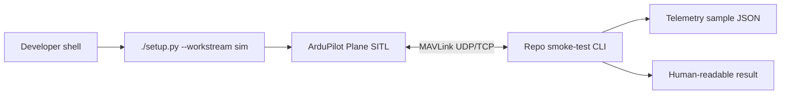

# SITL smoke test

This page tracks the first software-in-the-loop (SITL) implementation milestone. The basic smoke test now exists and should stay observation-only until command policy and safety gates are documented. See the [glossary](../appendix/glossary.md) for recurring abbreviations.

## Goal

Create a repeatable local workflow that proves the repo can connect to a virtual fixed-wing aircraft and observe it safely.



## Current implementation

The first slice is intentionally small because the repo already uses `uv` and the `sim` dependency group for MAVLink client tooling.

Current layout:

```text
tools/
└── sitl/
    ├── README.md
    ├── run.py
    └── smoke_test.py

tests/
└── tools/
    └── sitl/
        ├── test_run.py
        └── test_smoke_test.py

artifacts/
└── sitl/
    └── smoke.json          # generated, not committed
```

These paths are the first slice of the canonical layout described in [Development stack](../software/development-stack.md#monorepo-layout). Keep the boundaries:

| Boundary | Rule |
|---|---|
| SITL | External ArduPilot checkout, not vendored into this repo |
| Repo command-line interface (CLI) | Connects to MAVLink and records observations |
| Tests | Validate parser/output contracts without requiring SITL for every unit test |
| Artifacts | Generated local evidence under `artifacts/`; do not commit routine smoke-test output |

## Local setup skeleton

The detailed, working local procedure lives in `tools/sitl/README.md`. The executive summary is:

```bash
./setup.py --workstream sim --no-shell
uv run --group sim python -c "import mavsdk, pymavlink; print('mavlink clients ok')"
uv run tools/sitl/run.py --setup-only
uv run tools/sitl/run.py --install-prereqs --setup-only
uv run tools/sitl/run.py --mavlink-out udp:127.0.0.1:14550
```

The default local ArduPilot checkout path is configured through `.env`:

```bash
ARDUPILOT_REPO=~/ws/ardupilot
```

The helper defaults to `--vehicle plane` because this repository's learning path is fixed-wing first. Use another ArduPilot vehicle only when a specific experiment needs it, for example `--vehicle copter`. The explicit MAVLink output gives repo smoke-test clients a stable endpoint.

For repeated runs after the first successful ArduPilot build, use `uv run tools/sitl/run.py --no-wipe -- -N` to preserve simulated parameters and skip ArduPilot's default rebuild.

When SITL launches, use the MAVProxy prompt in the launch terminal for commands. The window titled `console` is a status/log display, `ArduPlane` is the simulator window, and `Map` is the map view.

Run the observation-only smoke test from a second terminal:

```bash
uv run --group sim python tools/sitl/smoke_test.py --connect udp:127.0.0.1:14550
```

The command writes `artifacts/sitl/smoke.json`, verifies the heartbeat is fixed-wing, verifies the vehicle is unarmed, records `commanded_actions: []`, and prints a short human-readable summary.

## Telemetry to capture first

Capture only enough to prove the link and support later safety checks.

| Field | Why |
|---|---|
| Timestamp | Correlates events, logs, and video later |
| System/component identifiers (IDs) | Confirms which MAVLink endpoint replied |
| Heartbeat and mode | Confirms vehicle identity and current control state |
| Armed state | Proves the smoke test did not arm the vehicle |
| Position / relative altitude | Proves basic telemetry subscriptions work |
| Battery status | Needed for later low-battery failure drills |
| Link or message timing | Shows stale-data handling can be tested |

Current artifact shape:

```json
{
  "commanded_actions": [],
  "connected": true,
  "heartbeat": {
    "armed": false,
    "autopilot": 3,
    "component_id": 0,
    "custom_mode": 0,
    "mode": "MANUAL",
    "system_id": 1,
    "vehicle_type": 1
  },
  "schema_version": 1,
  "source": "sitl-smoke-test"
}
```

## Safety constraints

The first smoke test must be observation-only.

```text
[ ] no arming command
[ ] no mode change command
[ ] no mission upload
[ ] no parameter write
[ ] no actuator command
[ ] no detector/model decision in the loop
```

Later tests can add controlled commands, but only after the command policy and safety gates are documented.

## Current failure cases

The current script handles the first safety-critical setup failures:

| Failure | Expected behavior |
|---|---|
| SITL not running | CLI exits with a clear no-heartbeat message |
| Wrong endpoint | CLI prints the attempted endpoint and times out |
| No heartbeat | CLI fails before subscribing to telemetry |
| Vehicle is armed | CLI exits before writing a passing result |
| Vehicle is not fixed-wing | CLI exits before writing a passing result |

## Future steps

Add these only after the basic heartbeat smoke test remains stable:

1. Capture link timing and heartbeat age so stale telemetry can be detected explicitly.
2. Add a minimal position or relative-altitude sample from `GLOBAL_POSITION_INT`.
3. Add a `--expected-vehicle` option only if non-plane smoke tests become useful.
4. Keep command-sending tests separate from this smoke test until command policy and safety gates are documented.

## Done for milestone 1

The milestone is done when the implementation proves this path:

```text
setup sim tools -> start ArduPlane SITL -> run repo smoke test -> save telemetry sample -> review result
```

Keep the result boring. The value is a dependable baseline that every later autonomy feature can run against.
