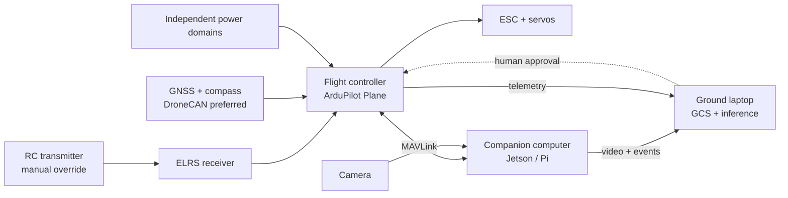

# Fixed-Wing Autonomy Lab

> **Project target:** a modular, repairable fixed-wing aircraft that can fly safely under an established autopilot, stream or record video, and progress from ground-side object detection to tightly bounded onboard perception.

### Recommended starting point
**Upgradeable reference build**: 1.6–2.0 m pusher airframe, H7-class ArduPilot flight controller, DroneCAN-ready GNSS, ELRS manual-control link, independent telemetry/video path, and a laptop-first vision workflow.

### Deliberately deferred
VTOL, autonomous launch/landing, visual obstacle avoidance, target chasing, and any experimental code that directly commands the control surfaces.

### Core safety rule
The flight controller owns flight safety. The companion computer may **observe**, **log**, and later request a small set of prevalidated mission actions. It must never become a single point of failure.

## The reference architecture

## One system, three stages

| Stage | Where vision runs | What it may do | Required flight behavior |
|---|---|---|---|
| **A — Observe** | Laptop | Draw boxes, record detections, correlate with aircraft state | Manual/stabilized flight only |
| **B — Assist** | Laptop or Jetson | Trigger snapshots, annotations, operator alert | Simple preplanned missions; manual takeover always ready |
| **C — Bounded autonomy** | Jetson | Request a preconfigured loiter or camera action after strict validation | Geofence, RTL, pilot override, conservative test gate passed |

!!! warning "Do not collapse the stages"
    A detector that works on a bench video is not automatically safe in flight. Keep the first closed-loop behavior mission-level and reversible: for example, **“marker detected → send alert → operator chooses whether to loiter.”**

## Why MkDocs Material + GitHub Pages

This repository uses MkDocs Material because the content remains plain Markdown, diagrams are versioned with the text, the static output is cheap to host, and GitHub Actions can publish it. It is the best default for a technical project handbook. Alternatives are listed below.

| Option | Choose it when | Trade-off |
|---|---|---|
| **MkDocs Material + GitHub Pages** | Primary objective is durable technical documentation | Less freedom for highly bespoke interactive UI |
| **Astro Starlight + GitHub Pages/Cloudflare Pages** | You want more custom React/JS interfaces and a polished product site | Higher frontend maintenance |
| **Docusaurus + GitHub Pages** | You expect a large developer community and docs versioning | Heavier Node/React toolchain |
| **GitBook / Notion** | You want zero infrastructure for a small private team | Vendor dependency; reduced repo-native workflow |

**Recommendation:** keep this site in the same Git repository as configuration exports, code, CAD, and test records. The docs then become a reproducible engineering record—not a disconnected wiki.

## How to use this guide

1. Follow the [Learning path](start/learning-path.md): start with docs and SITL before buying aircraft hardware.
2. Decide how much payload and future compute headroom you need in [Configuration chooser](start/configuration-chooser.md).
3. Freeze interfaces before buying individual parts.
4. Buy safety-critical modules and the radio system before companion compute.
5. Use each [test gate](operations/test-gates.md) as a release criterion, not as a suggestion.
