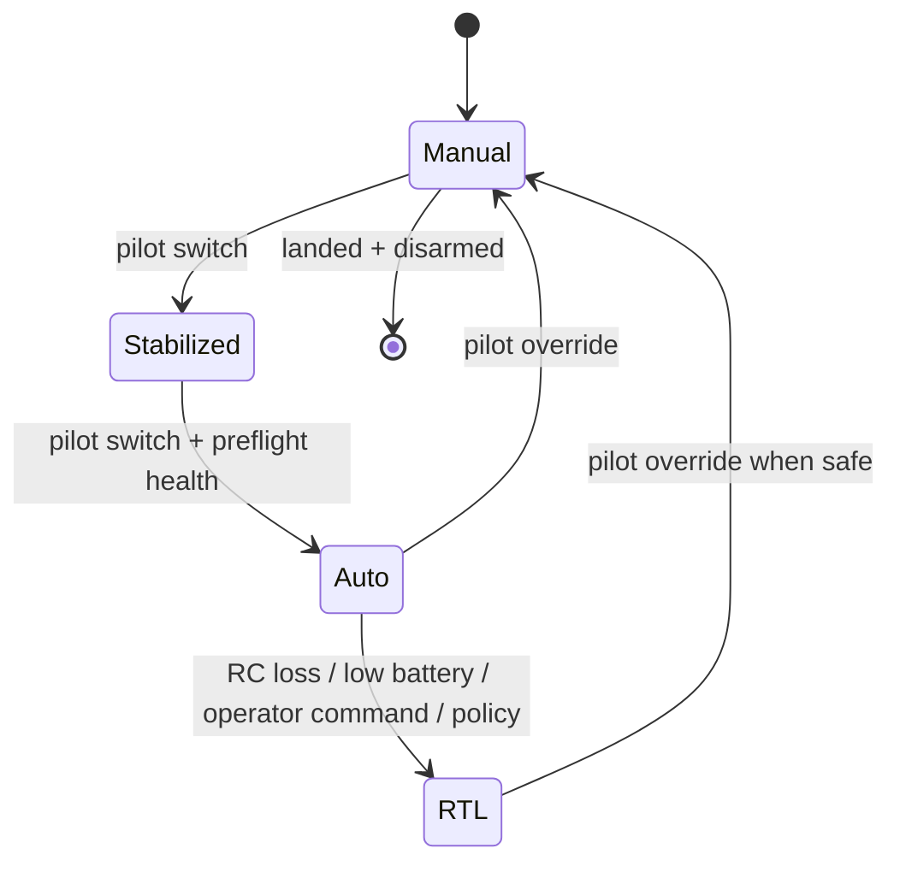

# Failsafe design

## Failure-to-response matrix

| Failure | Detection | Flight-controller response | Companion response |
|---|---|---|---|
| RC loss | Receiver / FC | Preconfigured RTL or safe behavior | Stop action requests; log event |
| Telemetry loss | Ground link timeout | Continue configured mission / RTL policy | Continue local recording; no unbounded action |
| Video loss | Stream health | No change to basic flight safety | Mark detections invalid; store local video |
| Companion crash | Heartbeat timeout / MAVLink disconnect | No change; FC remains authoritative | Auto-restart locally if possible |
| Battery reserve low | Power module | Preconfigured RTL / landing policy | Stop nonessential compute workload |
| GNSS/EKF unhealthy | FC estimator | Mode-specific safe fallback | Invalidate location-associated detections |
| Geofence breach | FC | Preconfigured fence action | Stop requests, log condition |

## State machine



## Companion fail-closed behavior

```text
No current telemetry → no event action.
No fresh camera frame → no event action.
No pilot link health → no event action.
No explicit approved test mode → no event action.
Any exception → LOG_ONLY + service health alert.
```
