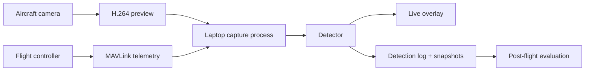

# Ground-side inference

## Objective

Build an observability loop before building an autonomy loop.



## Minimum viable toolchain

```bash
# environment example; pin exact versions per project release
python -m venv .venv
source .venv/bin/activate
pip install opencv-python numpy onnxruntime mavsdk pandas
# add your selected detector package or ONNX model wrapper
```

### Responsibilities by process

| Process | Responsibility | Must never do |
|---|---|---|
| `capture` | Receive stream, timestamp frames, reconnect on failure | Block flight telemetry loop |
| `telemetry` | Subscribe to MAVLink, cache latest valid state | Invent state if messages are stale |
| `detector` | Produce label/confidence/bounding box | Send direct servo/throttle commands |
| `validator` | Apply debounce, confidence, freshness and test-mode policy | Treat one frame as a mission command |
| `logger` | Write event, frame reference, state and config | Drop errors silently |
| `viewer` | Present human-readable overlay | Become the only safety interface |

## Start task: orange marker detection

1. Make a high-contrast, known-size orange ground marker.
2. Record video during manual or waypoint flights over a safe field.
3. Run detector offline on the original recording.
4. Compare false positives, missed detections and confidence distribution.
5. Move to live laptop inference at low resolution.
6. Log only; do not request aircraft behavior.

## Event validation example

```python
from dataclasses import dataclass
from time import monotonic

@dataclass
class Detection:
    label: str
    confidence: float
    frame_time: float

class EventValidator:
    def __init__(self, threshold: float = 0.85, required_hits: int = 3):
        self.threshold = threshold
        self.required_hits = required_hits
        self.hits = 0

    def accept(self, det: Detection, telemetry_age_s: float) -> bool:
        if telemetry_age_s > 0.5 or det.confidence < self.threshold:
            self.hits = 0
            return False
        self.hits += 1
        return self.hits >= self.required_hits
```

This code demonstrates **logging qualification**, not flight control.

## Evaluation metrics

| Metric | Why it matters |
|---|---|
| Precision / false-alert rate | Operator trust and unnecessary mission interruptions |
| Recall | How often useful targets are missed |
| End-to-end latency | Whether frames correspond to current aircraft state |
| Telemetry age | Whether position/attitude association is meaningful |
| Frame-drop/reconnect rate | Video-link reliability |
| Per-flight reproducibility | Whether a result can be debugged later |
