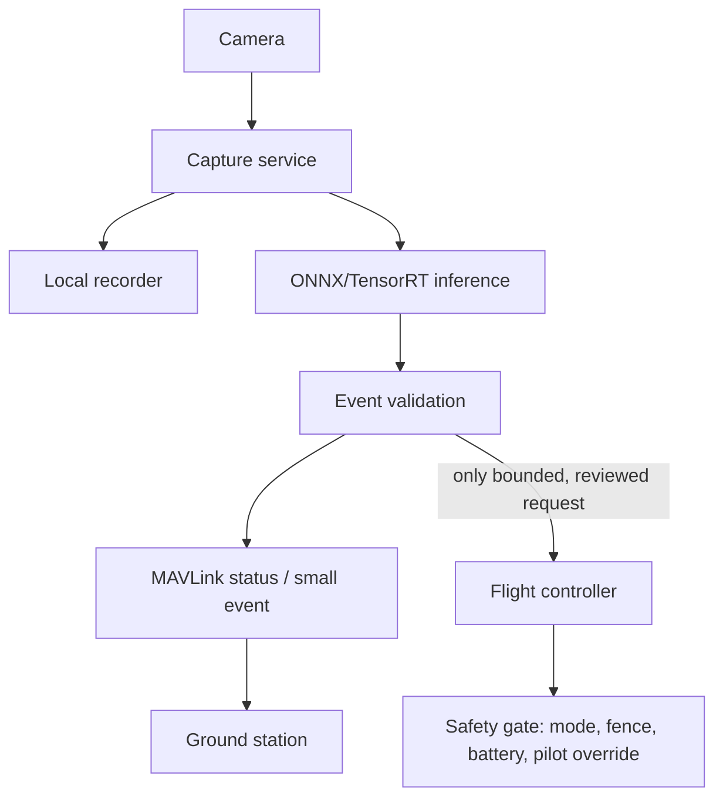

# Onboard inference

## Promote only a stable ground workflow

Onboard compute should be added when laptop inference has shown a clear, measured need: reduced link dependency, lower latency, or privacy/data-volume benefits.



## Companion-computer service design

| Service | Input | Output | Failure behavior |
|---|---|---|---|
| `mavlink-router` | FC UART/USB | local UDP/TCP endpoints | FC still has RC and configured failsafe |
| `capture` | Camera | frames + health status | restart independently; no FC reset |
| `recorder` | frames | local video segments | disk-full alerts; bounded retention |
| `inference` | frames/model | detection events | watchdog restart; events expire |
| `event-validator` | detections + telemetry | log/status/request | default is log-only |
| `health-monitor` | service heartbeats | status + optional low-priority alert | no direct actuator control |

## Model deployment workflow

```text
train / choose model on workstation
→ export ONNX
→ validate with recorded flight video
→ benchmark on target Jetson under power/thermal limits
→ deploy immutable model file + manifest
→ run dry mission in SITL/replay
→ enable LOG_ONLY onboard
→ only then consider bounded mission request
```

## Bounded mission request policy

A companion may request a **preconfigured loiter/camera action** only when all conditions are true:

```text
[ ] Flight mode is permitted by project policy
[ ] Pilot override link is healthy
[ ] Geofence is active and valid
[ ] Battery reserve exceeds defined threshold
[ ] GNSS/EKF status is healthy
[ ] Detection passes multi-frame confirmation
[ ] Companion and telemetry data are fresh
[ ] Request has a timeout and an operator-cancel path
[ ] The target action is already configured/tested in the flight controller
```

The companion should not implement continuous roll/pitch/throttle control. It should call a narrowly defined action interface, log every request, and default to no action.
