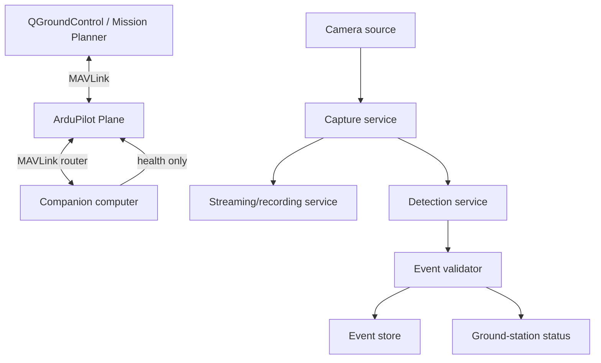

# System architecture

## Software contracts



## Recommended libraries and tools

| Need | Default | Alternatives | License / integration note |
|---|---|---|---|
| Autopilot | ArduPilot Plane | PX4 fixed-wing | ArduPilot is GPLv3; treat it as the flight-safety authority |
| Ground station | QGroundControl / Mission Planner | MAVProxy | GCS is separate from custom code |
| Vehicle API | MAVSDK-Python | pymavlink | MAVSDK is BSD-3-Clause and high-level; pymavlink is lower-level |
| MAVLink routing | mavlink-router | MAVProxy routing | Keep routing configuration versioned |
| Capture / overlay | OpenCV | GStreamer-only | OpenCV 4.5+ is Apache-2.0 |
| Video transport | GStreamer | FFmpeg / WebRTC | Use H.264 first; profile latency/quality empirically |
| Model runtime | ONNX Runtime | TensorRT on Jetson | ONNX Runtime is MIT; TensorRT is NVIDIA-provided, not open source |
| Training framework | Ultralytics YOLO | MMDetection / YOLOX | Ultralytics uses AGPL-3.0 unless separately licensed—evaluate before commercial distribution |
| Tracking | Norfair / ByteTrack | OpenCV trackers | Treat tracking as a confidence aid, not truth |
| Dataset labels | CVAT | Label Studio | Keep images, labels, split and model version together |
| Experiment records | DVC + Git LFS | MLflow / plain manifests | Avoid putting large raw videos in normal Git history |

## Repository structure

```text
fixed-wing-autonomy/
├── docs/                 # This site
├── aircraft/
│   ├── parameters/       # ArduPilot parameter exports
│   ├── missions/         # Waypoints / fence files
│   └── wiring/           # schematics, photos, pin maps
├── companion/
│   ├── services/         # systemd units / Docker files
│   └── config/           # mavlink-router, camera, health policies
├── vision/
│   ├── capture/
│   ├── inference/
│   ├── datasets/
│   ├── models/           # manifests, not large weights by default
│   └── evaluation/
├── ground/
│   └── gcs-tools/
└── tests/
    ├── sitl/
    ├── replay/
    └── checklists/
```

## Message contract: detection event

```json
{
  "schema_version": 1,
  "event_id": "uuid",
  "time_utc": "2026-07-05T12:34:56.789Z",
  "frame_id": "cam0-00012345",
  "model_id": "marker-detector-0.2.1",
  "label": "orange_marker",
  "confidence": 0.91,
  "bbox_xywh_px": [211, 143, 104, 87],
  "vehicle_state": {
    "lat_deg": 0.0,
    "lon_deg": 0.0,
    "alt_rel_m": 0.0,
    "heading_deg": 0.0,
    "flight_mode": "AUTO"
  },
  "action": "LOG_ONLY"
}
```

!!! note "Location is initially approximate"
    An aircraft position associated with an image is not the ground location of the detected object. Accurate target geolocation needs camera calibration, camera/body pose, aircraft attitude, terrain model, and ray/ground intersection.
