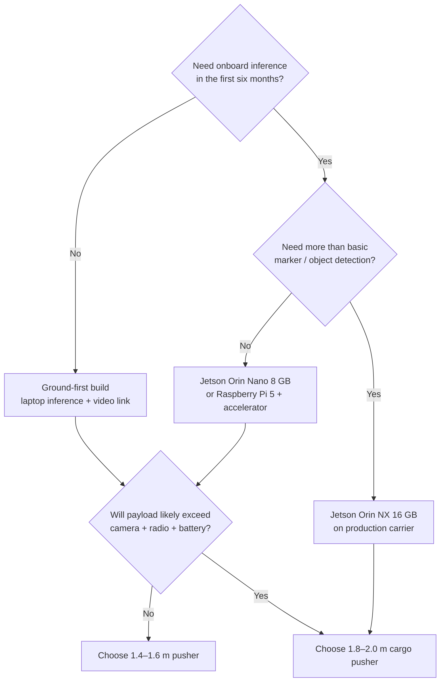

# Configuration chooser

Start with the desired *end state*, then select the smallest architecture that reaches it without forcing a rebuild.

## Choose a build profile

| Profile | Best for | Initial inference | Upgrade headroom | Avoid if |
|---|---|---|---|---|
| **Ground-first** | Learning flight, collecting data, laptop-powered development | Laptop | High—add compute later | You need no-dependency detection in the air immediately |
| **Reference build** **(recommended)** | Avoiding a second purchase cycle while keeping complexity manageable | Laptop, then Orin Nano | Very high | You need a sub-250 g aircraft |
| **Compute-forward** | Multiple cameras, tracking, mapping experiments | Jetson Orin NX | Maximum | You have not yet validated your power, cooling, and field workflow |

## The recommended long-life baseline

### Airframe
1.6–2.0 m pusher, fixed wing, accessible fuselage bay, removable wing, space around center of gravity, repairable EPO or composite structure.

### Flight core
H7-class ArduPilot flight controller, GNSS with compass, airspeed sensor provision, high-quality power/current module, RC receiver, buzzer.

### Compute path
Laptop-first vision; reserve a protected mount, fused power branch, UART/USB route, camera harness, and ventilation for an Orin-class companion.

!!! tip "A sophisticated aircraft need not run sophisticated software on day one"
    Buy the airframe, power system, flight controller and interface capacity for the later system. Keep the early software behavior deliberately simple.
