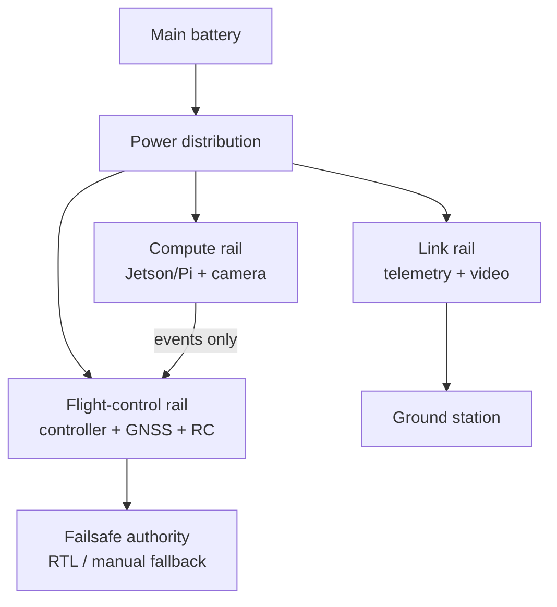

# Design principles

## 1. Buy interfaces, not product names

Every module must have a documented replacement path. The table below is the project’s compatibility contract.

| Domain | Primary interface | Replacement rule |
|---|---|---|
| Autopilot ↔ companion | MAVLink over UART or USB | Any companion must be able to speak MAVLink; no custom flight-control protocol |
| GNSS / compass | DroneCAN preferred; UART acceptable | Do not consume the final spare UART for a sensor likely to grow |
| RC manual control | ExpressLRS CRSF/UART | Receiver may change, but an immediate pilot override remains mandatory |
| Video | UVC USB or CSI camera → H.264/H.265 | Keep camera capture independent from the flight controller |
| Telemetry | MAVLink over radio/network | Video failure must not disable control/telemetry |
| Power | Separate regulated branches | Compute/video brownout must not reset the flight controller |
| Data | UTC timestamp + MAVLink system state | Every detection must be traceable to a frame and aircraft state |

## 2. Separate four failure domains



A failure in the compute or video branch must leave the aircraft stabilized, controllable, and able to execute its configured failsafe. This is more important than throughput or model accuracy.

## 3. Preserve pilot authority

Use a physical transmitter switch for manual/stabilized/auto mode selection. The vision stack must never be the only way to recover from a fault.

**Minimum required pilot actions:**

- command a safe stabilized mode;
- command Return-to-Launch (RTL) where configured and tested;
- disarm on the ground;
- observe link and battery state;
- abort the mission without restarting the companion computer.

## 4. Make every experiment replayable

Store a synchronized record of:

```text
raw video or keyframes
+ MAVLink telemetry log
+ model version and checksum
+ inference configuration
+ weather / field notes
+ operator decision
```

This turns a failed detection or flight anomaly into data rather than a mystery.

## 5. Prefer reversible decisions

Good early autonomy behavior: **create an alert, capture an image, start a preconfigured loiter only with operator approval.**

Poor early autonomy behavior: **detector changes bank angle, throttle or altitude continuously.**
