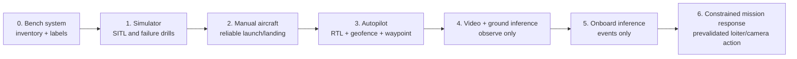

# Roadmap

## Milestone map

The first implementation target is the [SITL smoke test](../implementation/sitl-smoke-test.md). It turns milestone M1 into a small repo-owned workflow before any aircraft hardware is required.

## Stop/go criteria

| Milestone | “Go” only when | Never proceed when |
|---|---|---|
| M1 | You can recover from simulated RC loss, low battery, GPS issue and mission abort | You cannot explain the active flight mode or recovery action |
| M2 | Ten incident-free manual flights with repeatable center of gravity and landing behavior | You are still changing propulsion or control geometry each flight |
| M3 | RTL, mode switch, geofence and telemetry-loss behavior have been tested in a safe field | Failsafe is only configured on a laptop, not tested in the air |
| M4 | Detections are timestamped, logged and visually reviewable after flight | A model output changes flight control |
| M5 | Companion restart, camera disconnect and compute brownout do not destabilize the vehicle | Flight controller or RC receiver shares a fragile power path with compute |
| M6 | Every requested action has bounds, timeout, cancel path and manual override | The behavior depends on a single unvalidated confidence score |
